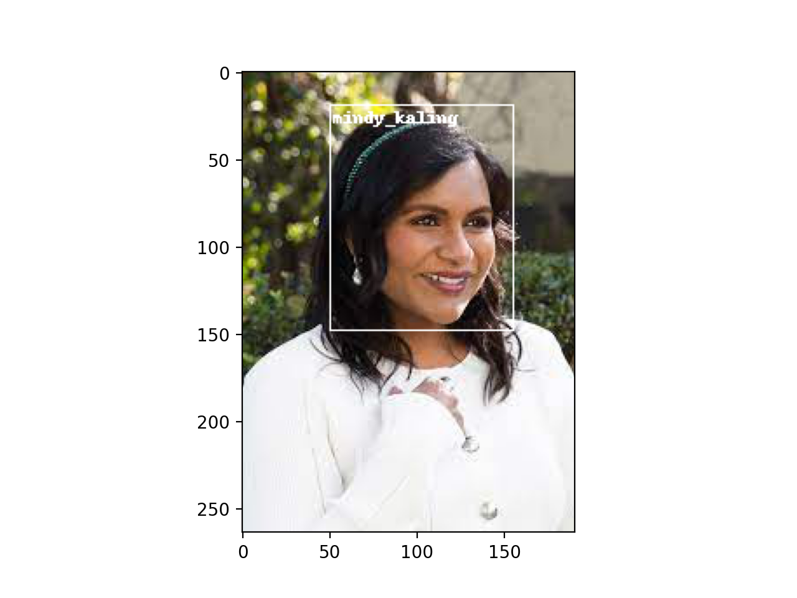

# Faster RCNN Implementation of Facial Recognition System



## Introduction

This repo is the faster rcnn implementation of our facial recognition network. It has support for celebrities in both the Kaggle dataset and the CelebA dataset.

## Installation

- Python >= 3.7 is required
- After installation, run

```
pip install requirements.txt
```

## Training

To train a model for the kaggle dataset, run the following command

```
python train.py
```

## Testing

To test a model for a given image, run the following command

```
python validation.py - $path_to_image$
```
